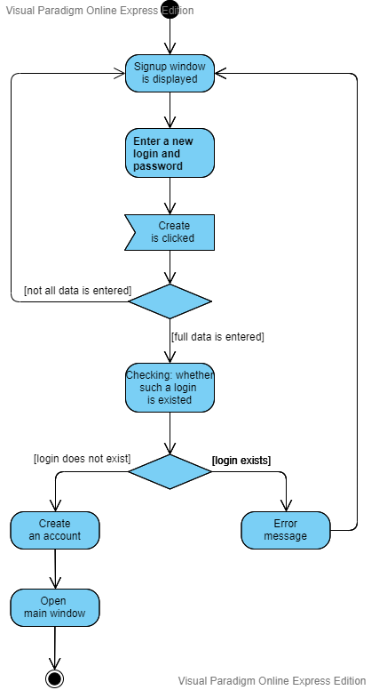
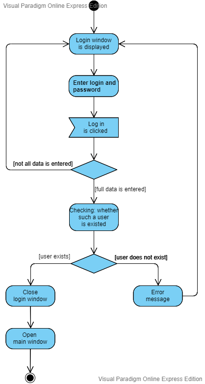
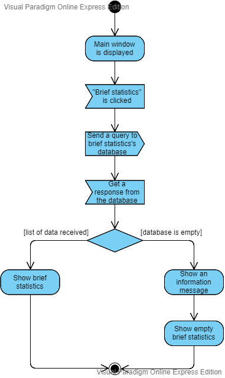
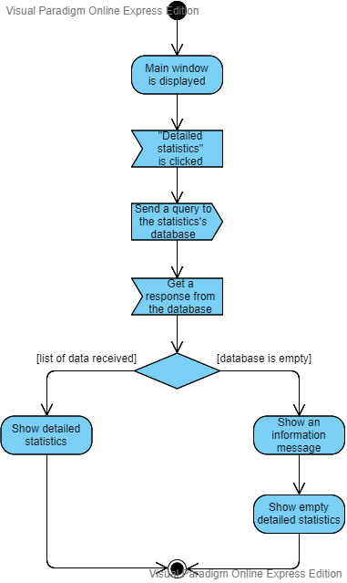
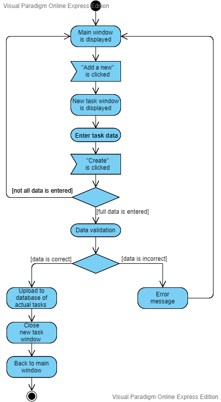

# Диаграммы активностей
---

# Содержание
1 [Создание нового аккаунта](#create_new_account)  
2 [Вход в учётную запись](#login)  
3 [Получение краткой статистики](#get_brief_statistics)  
4 [Получение полной статистики](#get_detailed_statistics)  
5 [Добавление нового задания](#create_new_task)

<a name="create_new_account"/>

# 1 Создание нового аккаунта

<a name="login"/>

# 2 Вход в учётную запись

<a name="get_brief_statistics"/>

# 3 Получение краткой статистики

<a name="get_detailed_statistics"/>

# 4 Получение подробной статистики

<a name="create_new_task"/>

# 5 Получение подробной статистики

